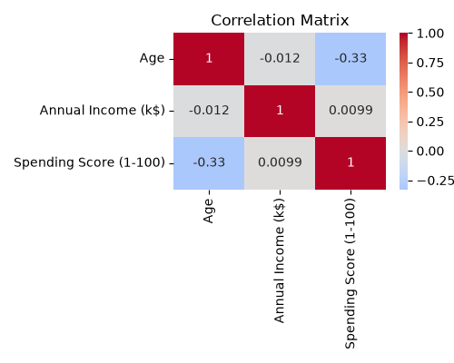
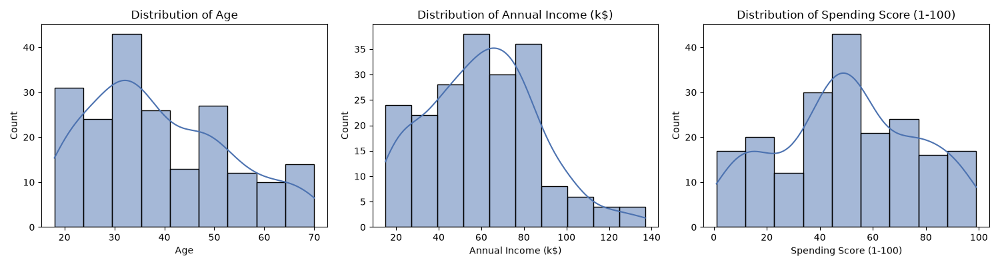
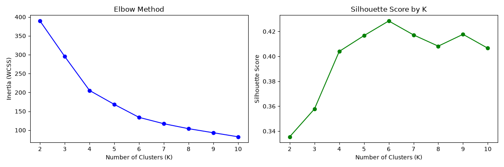
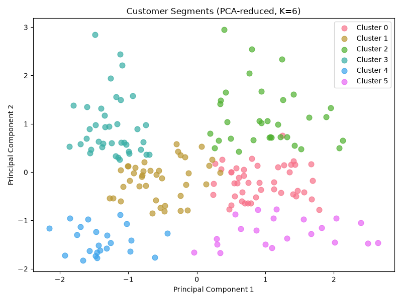

# 🛍️ Customer Segmentation using Unsupervised Machine Learning

Segmenting mall customers into behavior-based groups using K-Means clustering, PCA, and standardization — turning raw demographic and spending data into actionable marketing insights.


---

## 📌 Project Overview

Retailers often assume that **high income = high value customer** — but is that actually true? This project uses **unsupervised machine learning** to answer that question empirically, by clustering mall customers based on their **age, income, and spending behavior**, without any pre-labeled categories.

The goal: give a business a data-driven way to understand *who* their customers actually are, instead of relying on assumptions.

## 🎯 Objective

Apply multi-variable clustering to group customers by behavior, using:
- **Standardization** to normalize feature scales
- **Principal Component Analysis (PCA)** to reduce dimensionality for visualization
- **Elbow Method** and **Silhouette Score** to determine the optimal number of clusters
- **K-Means Clustering** to segment customers into distinct behavioral groups

## 📊 Dataset

**Source:** [Mall Customer Segmentation Dataset](https://www.kaggle.com/datasets/vjchoudhary7/customer-segmentation-tutorial-in-python) (Kaggle)

| Column | Description |
|---|---|
| `CustomerID` | Unique identifier (excluded from clustering) |
| `Gender` | Customer gender |
| `Age` | Customer age |
| `Annual Income (k$)` | Annual income in thousands of dollars |
| `Spending Score (1-100)` | Score assigned by the mall based on spending behavior |

200 records, no missing values, no significant outliers.

## 🔍 Exploratory Data Analysis

Key finding before any modeling: **Annual Income and Spending Score are essentially uncorrelated (r ≈ 0.01)**.



This is the central insight that justifies the entire approach — if income predicted spending, a simple business rule ("target high earners") would be enough. Since it doesn't, customers must be segmented using a method that can find non-obvious behavioral patterns — which is exactly what clustering does.



## ⚙️ Methodology

### 1. Standardization
Features were scaled using `StandardScaler` (mean = 0, std = 1). This is essential for K-Means because it's a distance-based algorithm — without scaling, `Annual Income` (range: 15–137) would dominate `Age` (range: 18–70) purely due to its larger numeric range, regardless of actual importance.

### 2. Dimensionality Reduction (PCA)
Reduced 3 standardized features into 2 principal components for visualization, retaining **77.6% of total variance** — enough to meaningfully visualize cluster separation in 2D.

### 3. Optimal K Selection
Tested K = 2 to 10 using both the **Elbow Method** (inertia/WCSS) and **Silhouette Score**:



**K = 6** was selected — it produced the highest silhouette score (**0.428**), and the elbow curve visibly flattens beyond this point, meaning additional clusters stop providing meaningful separation.

### 4. K-Means Clustering
Final model fit with K = 6, `random_state=42` for reproducibility.



## 📈 Results — Customer Segments

| Cluster | Avg. Age | Avg. Income | Avg. Spending Score | Size | Segment Label |
|---|---|---|---|---|---|
| 0 | 56 | $54k | 49 | 45 | Older, Moderate Spenders |
| 1 | 27 | $57k | 48 | 39 | Young, Average Spenders |
| 2 | 42 | $89k | 17 | 33 | High Income, Low Spenders |
| 3 | 33 | $87k | 82 | 39 | **High Income, High Spenders (VIP)** |
| 4 | 25 | $25k | 78 | 23 | Low Income, High Spenders |
| 5 | 46 | $26k | 19 | 21 | Low Income, Low Spenders |

## 💡 Business Recommendations

- **Cluster 3 (VIP)** — Highest-value segment. Prioritize loyalty programs, early access to sales, and premium experiences to retain them.
- **Cluster 2 (High Income, Low Spend)** — The biggest missed opportunity. These customers can afford to spend more but aren't engaging — worth investigating with targeted, premium-brand offers.
- **Cluster 4 (Low Income, High Spend)** — Enthusiastic but budget-constrained. Retain with discounts, installment options, and loyalty points; monitor for churn risk if competitors offer cheaper alternatives.
- **Cluster 5 (Low Income, Low Spend)** — Lowest marketing priority; acquisition cost is unlikely to be justified by return.
- **Clusters 0 & 1** — Stable, average-value segments suited to general seasonal promotions rather than targeted campaigns.

## 🛠️ Tech Stack

- **Python 3**
- **pandas / numpy** — data manipulation
- **matplotlib / seaborn** — visualization
- **scikit-learn** — StandardScaler, PCA, KMeans, silhouette_score

## 📁 Project Structure

```
customer-segmentation/
├── data/
│   └── raw/
│       └── Mall_Customers.csv
├── notebooks/
│   └── 01_eda.ipynb
├── src/
│   └── data_loader.py
├── outputs/
│   ├── customers_with_clusters.csv
│   └── figures/
├── requirements.txt
└── README.md
```

## ▶️ How to Run

```bash
git clone https://github.com/DataWithHamza/Customer-Segmentation.git
cd Customer-Segmentation
pip install -r requirements.txt
```

Then open `notebooks/01_eda.ipynb` in VS Code or Jupyter and run all cells.

## 🚀 Future Improvements

- Engineer RFM (Recency, Frequency, Monetary) features from raw transaction-level data for a more realistic segmentation
- Compare K-Means against Hierarchical Clustering and DBSCAN
- Build an interactive dashboard (Streamlit/Power BI) for stakeholders to explore segments
- Deploy as an API that assigns new customers to a segment in real time

## 👤 Author

**Hamza** — Data Science Student & ML Intern
📧 hamza.professional.connect@gmail.com
🔗 [GitHub](https://github.com/DataWithHamza)

---

*This project was built as a hands-on portfolio piece to demonstrate the full unsupervised ML workflow: from raw data to business-actionable customer segments.*
